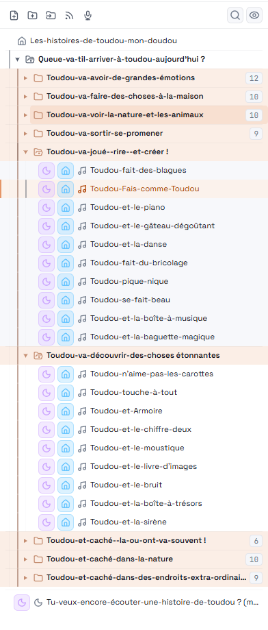
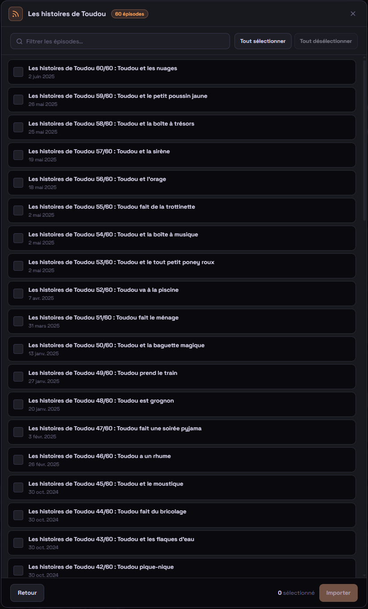
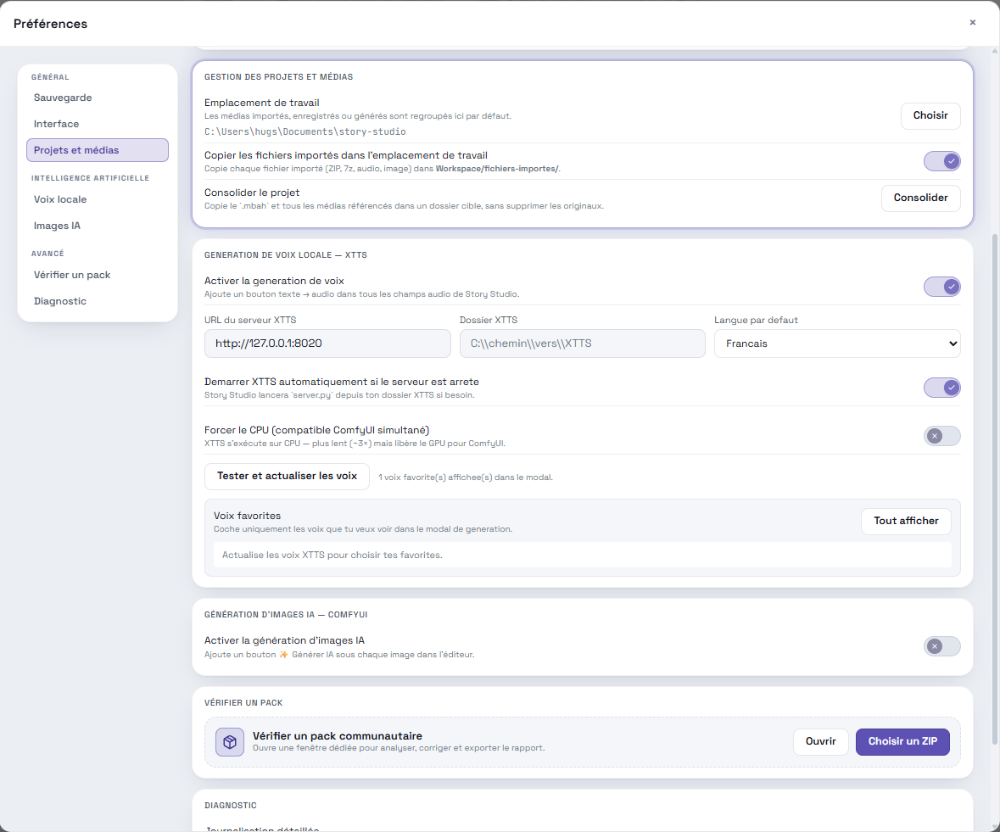

> [🇬🇧 English](README.md) | 🇫🇷 **Français**

  

  Éditeur Windows moderne pour créer, agréger, tester et exporter des packs d'histoires compatibles Lunii.

  
  
  
  
  
  
  

Story Studio permet de créer des histoires pour la Lunii, d'importer des packs
ZIP existants, d'organiser des menus, de vérifier les médias et d'exporter des
packs d'histoires compatibles Lunii dans un espace de travail Windows visuel.
Tout reste local : images, audio, navigation, simulation et export ZIP.

Importez vos médias, assemblez et découpez l'audio, recadrez les images,
organisez vos menus et vos récits, puis exportez un ZIP compatible Lunii sans
jongler entre plusieurs outils.

> Story Studio est un outil communautaire. Il n'est pas affilié à Lunii, ni
> soutenu ou sponsorisé par Lunii.

## Statut beta

Story Studio est actuellement en beta. L'app est utilisable, mais elle peut
encore contenir des bugs, des cas limites et des problèmes de compatibilité
avec certains packs communautaires. Garde des copies de sauvegarde de tes
projets importants et signale les problèmes reproductibles via les GitHub
issues.

## Dernière version

Story Studio 0.9.2 ajoute un vérificateur/correcteur de packs communautaires,
l'import de podcasts, le découpage audio avant utilisation, un workflow audio
basé sur le FLAC et une refonte complète de l'interface avec des rails de
navigation et des actions plus lisibles.

- [Télécharger la dernière version](https://github.com/Hugs11/story-studio/releases/latest)
- [Lire les notes de version 0.9.2](https://github.com/Hugs11/story-studio/releases/tag/v0.9.2)
- [Voir le changelog complet](CHANGELOG.md)

## En un coup d'œil

| | |
|---|---|
| **Statut** | Beta |
| **Plateforme** | Windows desktop |
| **Format projet** | `.mbah` |
| **Format d'export** | Packs ZIP compatibles Lunii |
| **Stack principale** | React 19, Vite, Tauri 2, Rust |
| **Workflow** | Éditeur arborescent visuel, agrégation de packs ZIP, navigation par nœuds, explorateur de médias, simulateur |
| **Vie privée** | App locale, aucun backend hébergé, aucune télémétrie |

## Captures d'écran

| Vérificateur de packs | Navigation dans l'arbre |
|---|---|
|  |  |

| Écran d'accueil | Métadonnées du pack |
|---|---|
|  |  |

| Options du pack | Diagramme et simulateur |
|---|---|
|  |  |

| Éditeur audio | Découpe audio |
|---|---|
|  |  |

| Assemblage audio | Import podcast |
|---|---|
|  |  |

| Préférences | Éditeur principal |
|---|---|
|  |  |

## Fonctionnalités

- **Éditeur visuel arborescent** avec menus imbriqués, multi-sélection, glisser-déposer et actions contextuelles.
- **Import de packs ZIP Lunii** : inspection, extraction en projet éditable, agrégation avec vos propres histoires.
- **Workflow audio intégré** : enregistrement micro, rognage, coupes, fondus, assemblage et insertion de silence.
- **Workflow image intégré** : recadrage 320×240 automatique, génération d'images textuelles depuis les noms.
- **Explorateur de médias** avec tags, filtres, compteurs d'utilisation et aperçus rapides.
- **Simulateur intégré** pour tester la navigation et les nœuds de fin avant export.
- **Validation et file de rendu** : vérifications de compatibilité et génération en série avec suivi des logs.
- **Intégrations locales optionnelles** XTTS (voix) et ComfyUI (images).
- **Confort projet** : autosave, versions de sécurité, raccourcis configurables, thèmes clair/sombre, vue diagramme.

## Pourquoi Story Studio ?

Je cherchais un outil simple pour créer des histoires audio pour mon enfant. En
tant qu'ancien monteur vidéo, je ne retrouvais pas dans les outils existants ce
qui me semblait essentiel : une interface visuelle, directe et fluide,
permettant de construire une narration sans friction, sans ligne de commande ni
structures de dossiers complexes.

Story Studio est né de ce besoin : rassembler l'import, les images, l'audio, la
navigation, la simulation et l'export dans un même espace clair, local et
compréhensible.

## Configuration requise

Windows 10 ou plus récent, avec WebView2. Les binaires tiers embarqués ont
leurs propres licences — voir [THIRD_PARTY_NOTICES.md](THIRD_PARTY_NOTICES.md).

## Installation

Téléchargez l'installeur Windows depuis la
[page GitHub Releases](https://github.com/Hugs11/story-studio/releases/latest).

Pour compiler depuis les sources ou contribuer, voir
[CONTRIBUTING.md](CONTRIBUTING.md).

## Fichiers projet et espace de travail

Story Studio enregistre les projets sous forme de fichiers `.mbah`. Les
assets d'exécution sont organisés dans des dossiers d'espace de travail
gérés :

| Dossier | Rôle |
|---|---|
| `fichiers-importes/` | Médias importés quand la copie à l'import est activée |
| `enregistrements/` | Enregistrements micro |
| `voix-generees/` | Clips vocaux générés par XTTS |
| `images-generees/` | Images générées par ComfyUI et images éditées |
| `zips-extraits/` | Collections ZIP décompressées |
| `sauvegardes/` | Dossier de sauvegarde par défaut + versions de sécurité |
| `exports/` | Dossier de sortie suggéré pour les packs générés |

Les fichiers dans les dossiers médias gérés utilisent un préfixe
`{nom-du-projet}__` pour que plusieurs projets puissent partager le même
espace de travail sans risque.

Quand Story Studio te propose de supprimer un média du disque, il ne
supprime que les fichiers à l'intérieur des dossiers médias gérés de
l'espace de travail. Les fichiers sources externes ne sont retirés que de
la référence projet ou bibliothèque médias.

## Documentation

- [Guide d'installation XTTS](docs/guides/xtts-setup.fr.md)
- [Guide d'installation ComfyUI](docs/guides/comfyui-setup.fr.md)
- [Modèle de sécurité](SECURITY.md)
- [Mentions tierces](THIRD_PARTY_NOTICES.md)
- [Changelog](CHANGELOG.md)

> ℹ️ Les trois derniers documents (SECURITY, THIRD_PARTY_NOTICES, CHANGELOG) sont uniquement en anglais pour le moment.

## Roadmap

- Sortir de beta avec une v1 polish pour Windows.
- Passer en multi-plateforme (macOS et Linux).
- Rendre le logiciel compatible avec d'autres types de boîtes à histoires.

## Contribuer

Les contributions sont les bienvenues, en particulier :

- Rapports de bugs reproductibles.
- Notes de compatibilité pour les packs communautaires.
- Améliorations de la documentation.
- Pull requests ciblées avec des notes de test claires.

Merci de lire [CONTRIBUTING.md](CONTRIBUTING.md) avant d'ouvrir une pull
request.

## Sécurité

Story Studio est un éditeur de fichiers desktop local. Les fonctionnalités
optionnelles XTTS et ComfyUI se connectent à des services locaux configurés
par l'utilisateur.

Voir [SECURITY.md](SECURITY.md) pour le modèle de permissions et la
procédure de signalement des vulnérabilités.

## Licence

Le code source de Story Studio est sous licence [MIT](LICENSE).

Les binaires tiers embarqués et les assets tiers copiés restent sous leurs
licences respectives. Voir [THIRD_PARTY_NOTICES.md](THIRD_PARTY_NOTICES.md).
