> 🇬🇧 **English** | [🇫🇷 Français](README.fr.md)

  

  A modern Windows desktop editor for creating, aggregating, testing and exporting Lunii-compatible story packs.

  
  
  
  
  
  
  

## Tu cherches a creer des histoires pour la Lunii ?

Story Studio est un editeur Windows open source pour creer, importer,
verifier et exporter des packs d'histoires compatibles Lunii. La documentation
francaise est disponible ici : [README.fr.md](README.fr.md).

Story Studio lets you create, import, organize, test and export
Lunii-compatible story packs in a visual Windows desktop workspace. Everything
stays local: images, audio, navigation, simulation and ZIP export.

Import your media, assemble and trim audio, crop images, organize menus and
story paths, then export a Lunii-compatible ZIP without juggling between
several tools.

> Story Studio is a community tool. It is not affiliated with, endorsed by, or
> sponsored by Lunii.

## Beta Status

Story Studio is currently in beta. The app is usable, but it may still contain
bugs, edge cases and compatibility issues with some community packs. Please keep
backup copies of important projects and report reproducible problems through
GitHub issues.

## Latest Release

Story Studio 0.9.4 introduces a unified and reorderable workspace, a clearer
level-based diagram, reusable audio and image workflows, and stronger
end-of-story fidelity from imported packs through simulation and generation.

- [Download the latest release](https://github.com/Hugs11/story-studio/releases/latest)
- [Read the v0.9.4 release notes](https://github.com/Hugs11/story-studio/releases/tag/v0.9.4)
- [See the full changelog](CHANGELOG.md)

## Demo packs

Discover Story Studio with two ready-to-open packs that you can explore in the
simulator and adapt in the editor:

<table>
  <tr>
    <td align="center" width="50%">
      <a href="https://drive.proton.me/urls/5ND49D487R#IxRa3Bd0Lm8L">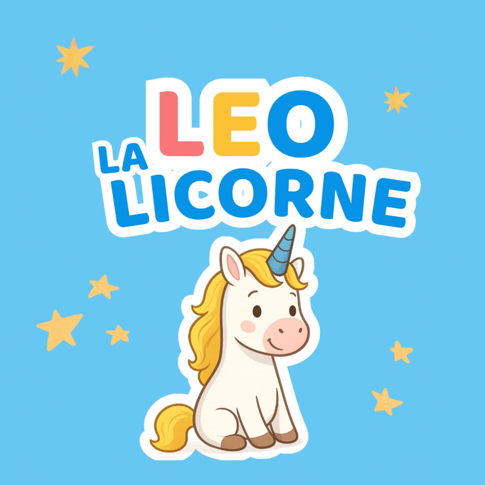</a> 
      <strong>Léo la licorne</strong> 
      <a href="https://drive.proton.me/urls/5ND49D487R#IxRa3Bd0Lm8L">Download from Proton Drive</a>
    </td>
    <td align="center" width="50%">
      <a href="https://drive.proton.me/urls/H7ZTBC8S14#aj2WBn39jDRF">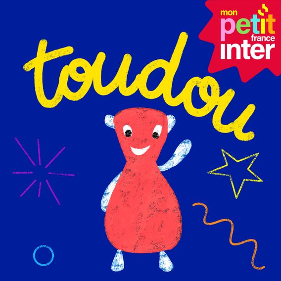</a> 
      <strong>Toudou mon doudou + Cache-Cache — complete collection</strong> 
      <a href="https://drive.proton.me/urls/H7ZTBC8S14#aj2WBn39jDRF">Download from Proton Drive</a>
    </td>
  </tr>
</table>

To explore a pack in Story Studio:

1. Download its ZIP file from Proton Drive.
2. Launch Story Studio and click **Modify an existing pack**.
3. Select the downloaded `.zip` file.

These packs are distributed separately from the software. Their stories, audio
files and illustrations are not covered by Story Studio's MIT license.

## At a Glance

| | |
|---|---|
| **Status** | Beta |
| **Platform** | Windows desktop |
| **Interface language** | French only for now |
| **Project format** | `.mbah` |
| **Export format** | Lunii-compatible ZIP packs |
| **Main stack** | React 19, Vite, Tauri 2, Rust |
| **Workflow** | Guided home workflows, visual tree editor, ZIP pack aggregation, node-based navigation, media explorer, simulator |
| **Privacy model** | Local app, no hosted backend, no telemetry |

## From first import to finished pack

Story Studio keeps the complete workflow in one local application: start from
your own files or an existing pack, prepare the media, build the navigation,
test the result and export a pack ready for the story box.

### 1. Start a project or import existing stories

Start however you like, reopen saved work, edit an existing ZIP/7z pack, or
start from a podcast or YouTube source. Dedicated guided flows also let you
aggregate several packs or inspect a community pack.

### 2. Prepare the audio

Import or record audio, then adjust it before using it in a story. A long
recording can be split into reusable clips, while several files can be reordered
and assembled into a single track without changing the originals.

| Split one recording into clips | Assemble several files into one track |
|---|---|
| 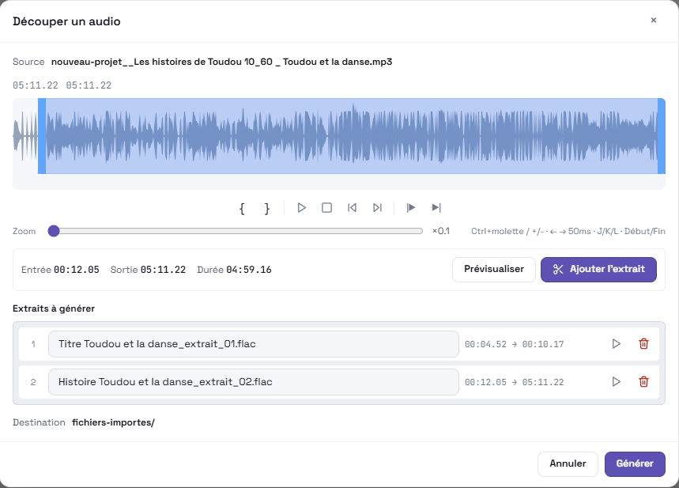 | 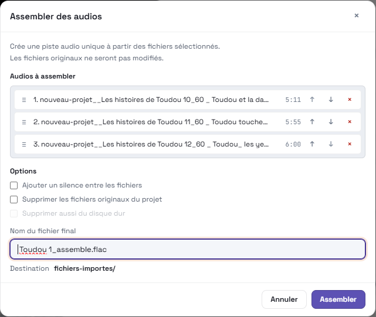 |

### 3. Create voices, generate artwork and adapt images

Generate voices locally with zero-config Piper or use XTTS for advanced voice
cloning. ComfyUI can produce illustrations through a local service, with both
voice and image jobs followed from Story Studio's generation queues.

| Generate a voice locally with Piper or XTTS | Generate an illustration with ComfyUI |
|---|---|
| 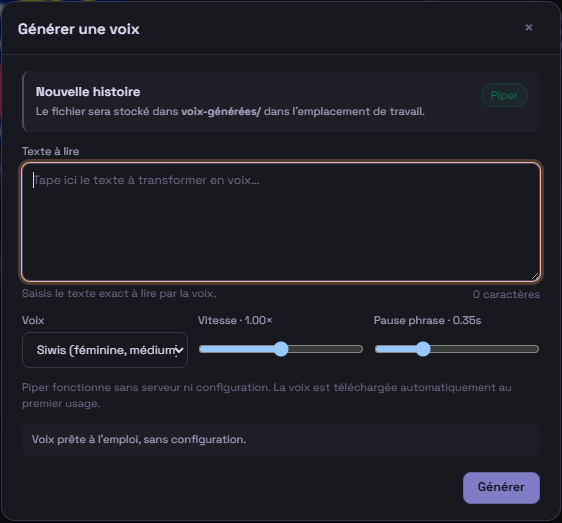 | 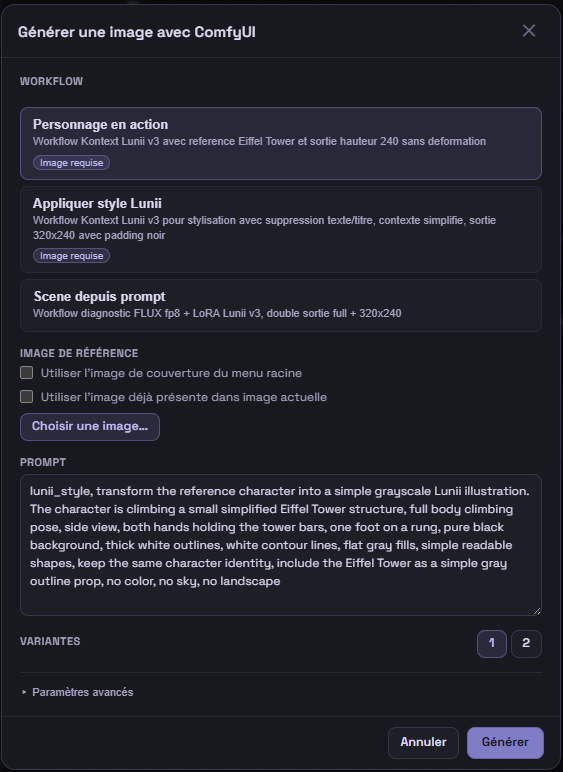 |

Images can then be cropped, resized and adjusted for the 320x240 story-box
format.

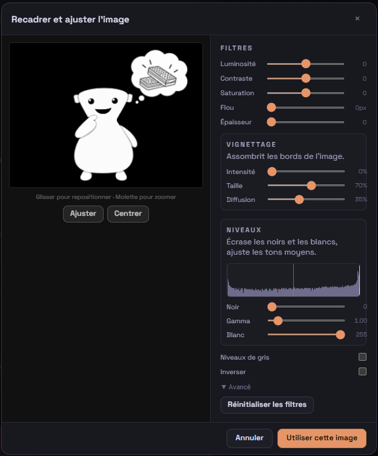

### 4. Organize the story and test its navigation

Build menus and stories in the tree, assign their images and audio, and define
what the buttons do during and after playback. The Media explorer keeps used
and unused files available alongside the project.

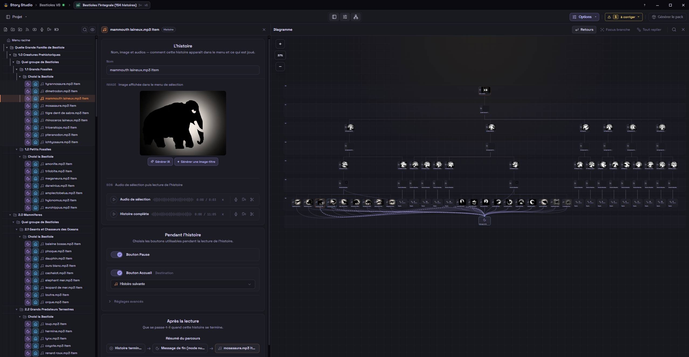

Open the diagram full-screen to understand the complete structure, story groups
and return paths without losing the level-by-level organization.

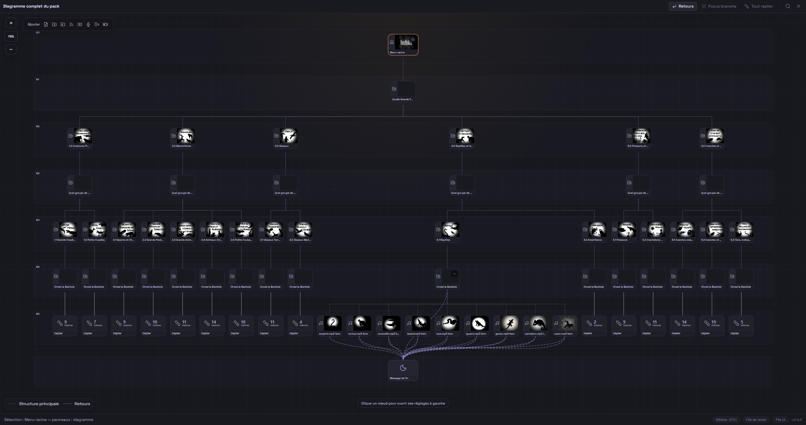

The floating simulator then lets you play through the same navigation directly
on top of the diagram before exporting.

### 5. Review the settings and generate the pack

Check the public metadata, cover, filename and pack-wide audio or navigation
options. Story Studio reports whether the project is ready, then generates the
Lunii-compatible ZIP from the same workspace.

| Review pack metadata before export | Adjust pack-wide generation settings |
|---|---|
|  | 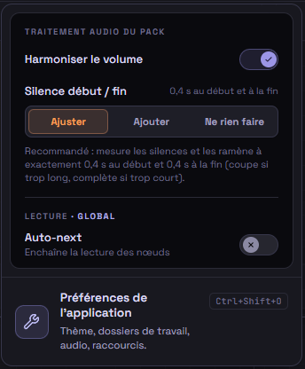 |

Existing community packs can also be analyzed separately. The checker groups
structural, image and audio findings, proposes safe corrections and can export
a detailed report.

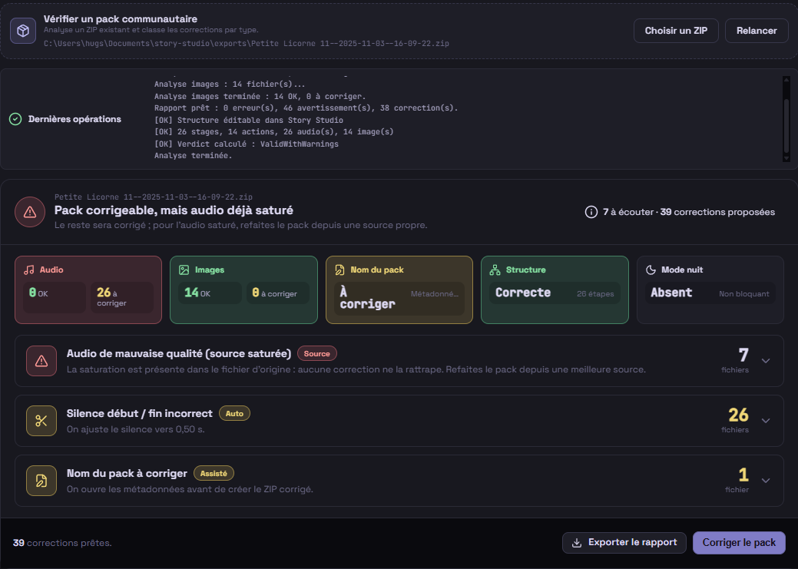

## Features

- **Visual tree editor** with nested menus, multi-select, drag-and-drop and contextual actions.
- **Guided home workflows** to edit an existing pack, create from a podcast or YouTube, aggregate ZIP packs, and check/correct a community pack.
- **Lunii ZIP pack import**: inspect, extract into an editable project, preserve branching graphs with shared references, and aggregate with your own stories.
- **Built-in audio workflow**: microphone recording, trimming, cuts, fades, assembly and silence insertion.
- **Built-in image workflow**: automatic 320×240 cropping, text-image generation from node names.
- **Local voice generation** with Piper by default and XTTS as an advanced opt-in backend.
- **Media explorer** with tags, filters, usage counters and quick previews.
- **Built-in simulator** to test navigation and end nodes before export.
- **Validation and render queue**: compatibility checks and serial generation with log tracking.
- **Optional local integrations** YouTube via yt-dlp, XTTS (voice) and ComfyUI (images).
- **Project comfort**: optional-save sessions, autosave, recovery snapshots, safety versions, configurable shortcuts, light/dark themes, full diagram view.

## Why Story Studio?

I was looking for a simple tool to create audio stories for my child. As a
former video editor, I could never find in existing tools what felt essential
to me: a visual and straightforward interface that makes building a narrative
fluid and frictionless, without relying on command-line tools or dealing with
complex folder structures.

Story Studio was born from that need: bringing import, images, audio,
navigation, simulation and export into one clear local workspace.

## Requirements

Windows 10 or later, with WebView2. Bundled third-party binaries keep their
own licenses — see [THIRD_PARTY_NOTICES.md](THIRD_PARTY_NOTICES.md).

## Installation

Download the Windows installer from the
[GitHub Releases page](https://github.com/Hugs11/story-studio/releases/latest).

To build from source or contribute, see [CONTRIBUTING.md](CONTRIBUTING.md).

## Project Files and Workspace

Story Studio saves projects as `.mbah` files. Runtime assets are organized in
managed workspace folders:

| Folder | Purpose |
|---|---|
| `fichiers-importes/` | Imported media files when copy-on-import is enabled |
| `enregistrements/` | Microphone recordings |
| `voix-generees/` | XTTS-generated voice clips |
| `images-generees/` | ComfyUI-generated and edited images |
| `zips-extraits/` | Unpacked ZIP collections |
| `sauvegardes/` | Default save folder and safety versions |
| `exports/` | Suggested output folder for generated packs |

Files in managed media folders use a `{project-name}__` prefix so multiple
projects can share the same workspace more safely.

When Story Studio offers to delete media from disk, it only deletes files inside
managed workspace media folders. External source files are removed from the
project or media library reference only.

## Documentation

- [XTTS setup guide](docs/guides/xtts-setup.md)
- [ComfyUI setup guide](docs/guides/comfyui-setup.md)
- [Security model](SECURITY.md)
- [Third-party notices](THIRD_PARTY_NOTICES.md)
- [Changelog](CHANGELOG.md)

## Roadmap

- Exit beta with a polished v1 for Windows.
- Go multi-platform (macOS and Linux).
- Adapt the app to support other story-box devices.

## Contributing

Contributions are welcome, especially:

- Reproducible bug reports.
- Compatibility notes for community packs.
- Documentation improvements.
- Focused pull requests with clear testing notes.

Please read [CONTRIBUTING.md](CONTRIBUTING.md) before opening a pull request.

## Security

Story Studio is a local desktop file editor. Optional XTTS and ComfyUI features
connect to local services configured by the user.

See [SECURITY.md](SECURITY.md) for the permissions model and vulnerability
reporting process.

## License

Story Studio source code is licensed under the [MIT License](LICENSE).

Bundled third-party binaries and copied third-party assets remain under their
respective licenses. See [THIRD_PARTY_NOTICES.md](THIRD_PARTY_NOTICES.md).
