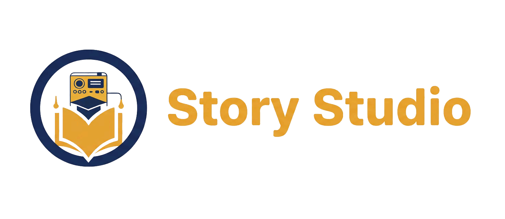

> 🇬🇧 **English** | [🇫🇷 Français](README.fr.md)

<p align="center">
  
</p>

<h1 align="center">Story Studio</h1>

<p align="center">
  A modern Windows desktop editor for creating, aggregating, testing and exporting Lunii-compatible story packs.
</p>

<p align="center">
  <a href=".github/workflows/ci.yml"></a>
  <a href="LICENSE"></a>
  <a href="#requirements"></a>
  <a href="CHANGELOG.md"></a>
  <a href="#beta-status"></a>
  <a href="https://tauri.app/"></a>
  <a href="https://react.dev/"></a>
</p>

Story Studio helps creators build interactive audio story packs with a visual,
local-first workflow. Organize menus and stories, manage audio and images,
preview navigation, aggregate existing ZIP packs and export Lunii-compatible
ZIP files from one desktop application.

> Story Studio is a community tool. It is not affiliated with, endorsed by, or
> sponsored by Lunii.

## Beta Status

Story Studio is currently in beta. The app is usable, but it may still contain
bugs, edge cases and compatibility issues with some community packs. Please keep
backup copies of important projects and report reproducible problems through
GitHub issues.

## At a Glance

| | |
|---|---|
| **Status** | Beta |
| **Platform** | Windows desktop |
| **Project format** | `.mbah` |
| **Export format** | Lunii-compatible ZIP packs |
| **Main stack** | React 19, Vite, Tauri 2, Rust |
| **Workflow** | Visual tree editor, ZIP pack aggregation, node-based navigation, media explorer, simulator |
| **Privacy model** | Local app, no hosted backend, no telemetry |

## Why Story Studio?

Story packs can become difficult to manage when they contain many menus,
recordings, imported ZIP packs, generated images and navigation rules. Story
Studio keeps those pieces visible and editable in a single workspace.

- Build simple stories or structured packs with nested menus.
- Aggregate existing ZIP packs into larger custom collections.
- Import community ZIP packs and inspect or edit them before re-export.
- Edit media without losing sight of where each file is used.
- Test navigation in the simulator before generating a final pack.
- Keep generated voices, generated images, recordings and imports organized in
  project workspace folders.

## Screenshots


| Diagram and simulator | Media explorer |
|---|---|
|  |  |

| Audio editor | Settings |
|---|---|
|  |  |

| Home screen |
|---|
|  |

## Features

### Pack Editing

- Simple story and multi-pack project modes.
- Visual editor for root menus, nested menus, stories, imported ZIP entries and
  end nodes.
- Drag-and-drop organization in the story tree, with multi-select,
  copy/cut/paste and contextual actions.
- Folder import workflow that can create one story per audio file.
- Community naming convention helper for pack title, metadata and versioning.
- Node-based navigation controls for playback, return targets, home behavior
  and end-of-story flows, including night-mode end nodes.
- Validation checks for common missing media, navigation and compatibility
  issues.

### Import, Preview and Export

- Import Lunii ZIP packs.
- Inspect imported packs and extract them into editable project entries.
- Aggregate imported ZIP packs with native menus and stories.
- Choose whether extracted ZIP audio should use the global start/end silence
  processing.
- Preview projects or imported packs in the built-in simulator.
- Generate Lunii-compatible ZIP packs with the native Rust pack engine.
- Queue multiple pack renders and follow their logs from the render queue.
- Optional post-generation ZIP validation that reports compatibility issues
  without blocking the export.

### Audio Workflow

- Record microphone audio directly from the app.
- Edit audio with waveform-based trimming, cuts, fades and preview.
- Assemble multiple audio files into one MP3.
- Optionally insert silence between assembled audio files.
- Import folders of audio files into story collections.
- Read embedded MP3 cover art when available.
- Manage generated voices and recordings inside the project workspace.
- Optional local XTTS integration for voice generation.

### Image and Media Workflow

- Media explorer for audio, images and ZIP files.
- Search, filters, sorting, tags, usage counters and quick previews.
- Drag media into the tree, diagram or editor fields.
- Crop/edit images and generate text images from node names.
- Automatically resize exported images to Lunii-compatible 320x240 assets.
- Optional local ComfyUI integration for image generation.

### Project and Interface Tools

- Recent projects home screen.
- Light, dark and system theme modes.
- Configurable keyboard shortcuts.
- Autosave, safety versions and project consolidation tools.
- Full-pack diagram view with branch focus and floating simulator support.

### Local-First Desktop App

- No hosted backend.
- No telemetry.
- Broad file selection for user-chosen assets, with guarded writes for managed
  project folders.
- Bundled command-line tools for local audio and ZIP operations.

## Requirements

- Windows 10 or later
- [Node.js](https://nodejs.org/) 20.19+ or 22.12+
- [Rust](https://rustup.rs/) stable toolchain
- [Tauri v2 Windows prerequisites](https://v2.tauri.app/start/prerequisites/),
  including WebView2

Bundled binaries are documented separately because they keep their own licenses.
See [THIRD_PARTY_NOTICES.md](THIRD_PARTY_NOTICES.md).

## Installation

### Download a Release

The recommended installation path will be the Windows installer from the GitHub
Releases page once the first public release is published.

### Run from Source

```powershell
git clone https://github.com/hugs11/story-studio.git
cd story-studio
npm install
npm run tauri dev
```

The dev server uses port `1420`. If that port is already busy:

```powershell
npx kill-port 1420
npm run tauri dev
```

## Development

Frontend and desktop commands:

```powershell
# Start the Tauri desktop app with hot reload
npm run tauri dev

# Build the frontend only
npm run build

# Build the full Windows desktop app
npm run tauri build
```

Rust checks:

```powershell
cd src-tauri
cargo test --all-targets
cargo clippy --all-targets -- -D warnings
```

Release bundles are generated under:

```text
src-tauri/target/release/bundle/
```

If you change `src-tauri/src/native_pack.rs`, run the Rust tests. That file
contains the native pack generation engine, where small regressions can produce
invalid packs.

## Project Files and Workspace

Story Studio saves projects as `.mbah` files. Runtime assets are organized in
managed workspace folders:

| Folder | Purpose |
|---|---|
| `fichiers-importes/` | Imported media files when copy-on-import is enabled |
| `enregistrements/` | Microphone recordings |
| `voix-generees/` | XTTS-generated voice clips |
| `images-generees/` | ComfyUI-generated and edited images |
| `zips-extraits/` | Unpacked ZIP collections |
| `sauvegardes/` | Default save folder and safety versions |
| `exports/` | Suggested output folder for generated packs |

Files in managed media folders use a `{project-name}__` prefix so multiple
projects can share the same workspace more safely.

When Story Studio offers to delete media from disk, it only deletes files inside
managed workspace media folders. External source files are removed from the
project or media library reference only.

## Documentation

- [XTTS setup guide](docs/guides/xtts-setup.md)
- [ComfyUI setup guide](docs/guides/comfyui-setup.md)
- [Release checklist](docs/release-checklist.md)
- [Security model](SECURITY.md)
- [Third-party notices](THIRD_PARTY_NOTICES.md)
- [Changelog](CHANGELOG.md)

## Roadmap

Near-term priorities:

- Publish the first beta installer from the `v0.8.9` release workflow.
- Smoke-test a fresh install on Windows before sharing the beta more broadly.
- Continue improving import/export compatibility with community packs.
- Keep audio and media workflows approachable for non-technical creators.

Longer-term ideas:

- More guided onboarding for first-time pack creators.
- Better diagnostics for unusual imported packs.
- Optional sample project for testing the editor quickly.
- Expanded documentation for advanced navigation workflows.

## Contributing

Contributions are welcome, especially:

- Reproducible bug reports.
- Compatibility notes for community packs.
- Documentation improvements.
- Focused pull requests with clear testing notes.

Please read [CONTRIBUTING.md](CONTRIBUTING.md) before opening a pull request.

## Security

Story Studio is a local desktop file editor. Optional XTTS and ComfyUI features
connect to local services configured by the user.

See [SECURITY.md](SECURITY.md) for the permissions model and vulnerability
reporting process.

## License

Story Studio source code is licensed under the [MIT License](LICENSE).

Bundled third-party binaries and copied third-party assets remain under their
respective licenses. See [THIRD_PARTY_NOTICES.md](THIRD_PARTY_NOTICES.md).
