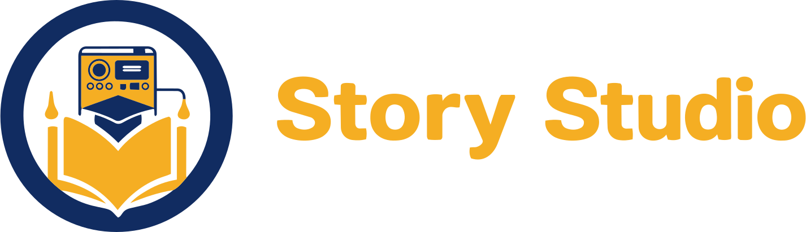
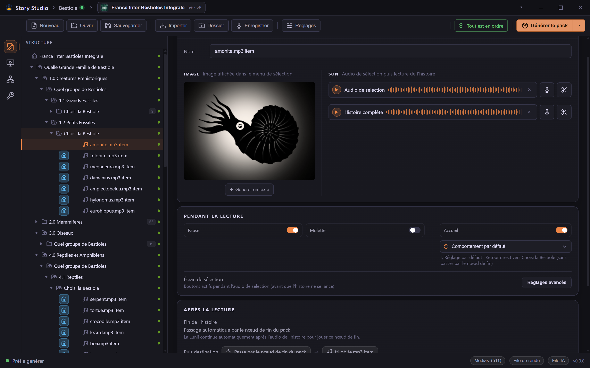
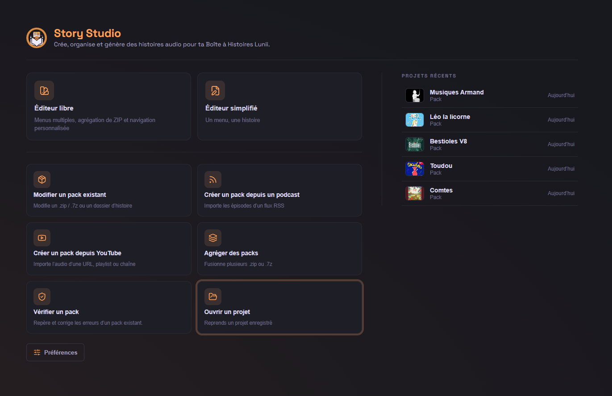
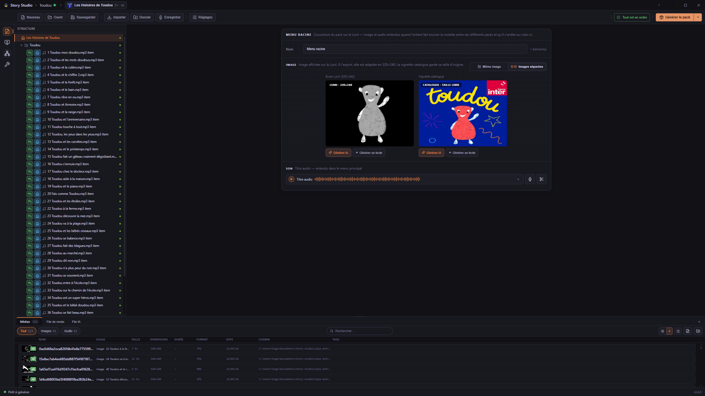
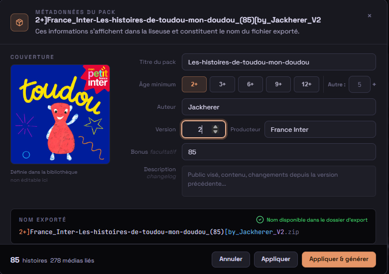
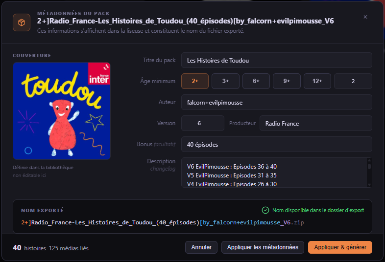
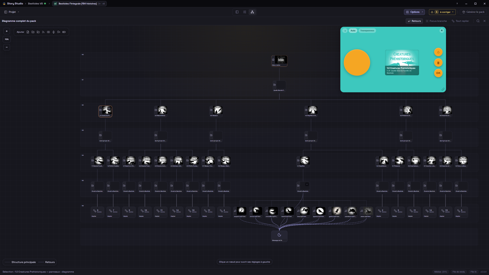
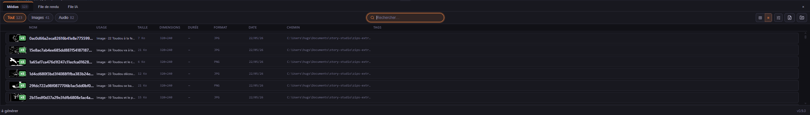
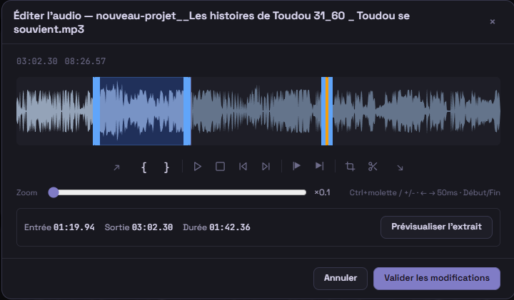
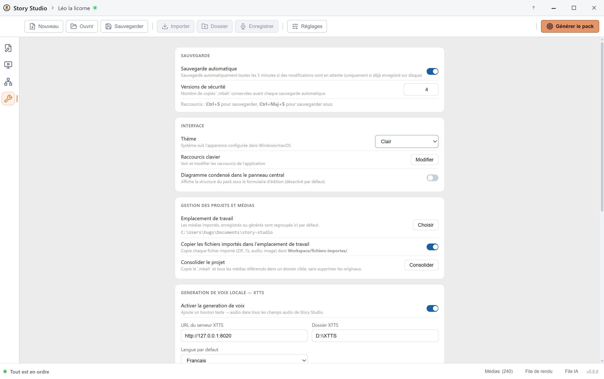

> 🇬🇧 **English** | [🇫🇷 Français](README.fr.md)

  

  A modern Windows desktop editor for creating, aggregating, testing and exporting Lunii-compatible story packs.

  
  
  
  
  
  
  

I was looking for a simple tool to create audio stories for my child. As a
former video editor, I could never find in existing tools what felt essential
to me: a visual and straightforward interface that makes building a
narrative fluid and frictionless, without relying on command-line tools or
dealing with complex and hard-to-read folder structures. Story Studio was
born from that need.

An open-source creation tool, it lets you imagine, organize, and export
interactive audio stories compatible with Lunii devices — in a clear and
intuitive workspace where every element naturally finds its place. Everything
stays stored locally on your computer.

Create stories for your story box without juggling between multiple
applications: import, edit, and crop your images, assemble and trim your
audio files, organize menus and story navigation, recover existing ZIP packs,
then easily export to a Lunii-compatible format.

> Story Studio is a community tool. It is not affiliated with, endorsed by, or
> sponsored by Lunii.

## Beta Status

Story Studio is currently in beta. The app is usable, but it may still contain
bugs, edge cases and compatibility issues with some community packs. Please keep
backup copies of important projects and report reproducible problems through
GitHub issues.

## At a Glance

| | |
|---|---|
| **Status** | Beta |
| **Platform** | Windows desktop |
| **Project format** | `.mbah` |
| **Export format** | Lunii-compatible ZIP packs |
| **Main stack** | React 19, Vite, Tauri 2, Rust |
| **Workflow** | Visual tree editor, ZIP pack aggregation, node-based navigation, media explorer, simulator |
| **Privacy model** | Local app, no hosted backend, no telemetry |

## Screenshots

| Home screen | Tree editor |
|---|---|
|  |  |

| Story editor | Pack metadata |
|---|---|
|  |  |

| Diagram and simulator | Media explorer |
|---|---|
|  |  |

| Audio editor | Settings |
|---|---|
|  |  |

## Features

- **Visual tree editor** with nested menus, multi-select, drag-and-drop and contextual actions.
- **Lunii ZIP pack import**: inspect, extract into an editable project, aggregate with your own stories.
- **Built-in audio workflow**: microphone recording, trimming, cuts, fades, assembly and silence insertion.
- **Built-in image workflow**: automatic 320×240 cropping, text-image generation from node names.
- **Media explorer** with tags, filters, usage counters and quick previews.
- **Built-in simulator** to test navigation and end nodes before export.
- **Validation and render queue**: compatibility checks and serial generation with log tracking.
- **Optional local integrations** XTTS (voice) and ComfyUI (images).
- **Project comfort**: autosave, safety versions, configurable shortcuts, light/dark themes, full diagram view.

## Requirements

Windows 10 or later, with WebView2. Bundled third-party binaries keep their
own licenses — see [THIRD_PARTY_NOTICES.md](THIRD_PARTY_NOTICES.md).

## Installation

Download the Windows installer from the
[GitHub Releases page](https://github.com/Hugs11/story-studio/releases/latest)
once the first public release is published.

To build from source or contribute, see [CONTRIBUTING.md](CONTRIBUTING.md).

## Project Files and Workspace

Story Studio saves projects as `.mbah` files. Runtime assets are organized in
managed workspace folders:

| Folder | Purpose |
|---|---|
| `fichiers-importes/` | Imported media files when copy-on-import is enabled |
| `enregistrements/` | Microphone recordings |
| `voix-generees/` | XTTS-generated voice clips |
| `images-generees/` | ComfyUI-generated and edited images |
| `zips-extraits/` | Unpacked ZIP collections |
| `sauvegardes/` | Default save folder and safety versions |
| `exports/` | Suggested output folder for generated packs |

Files in managed media folders use a `{project-name}__` prefix so multiple
projects can share the same workspace more safely.

When Story Studio offers to delete media from disk, it only deletes files inside
managed workspace media folders. External source files are removed from the
project or media library reference only.

## Documentation

- [XTTS setup guide](docs/guides/xtts-setup.md)
- [ComfyUI setup guide](docs/guides/comfyui-setup.md)
- [Security model](SECURITY.md)
- [Third-party notices](THIRD_PARTY_NOTICES.md)
- [Changelog](CHANGELOG.md)

## Roadmap

Near-term priorities:

- Publish the first beta installer from the `v0.9.0` release workflow.
- Smoke-test a fresh install on Windows before sharing the beta more broadly.
- Continue improving import/export compatibility with community packs.
- Keep audio and media workflows approachable for non-technical creators.

Longer-term ideas:

- More guided onboarding for first-time pack creators.
- Better diagnostics for unusual imported packs.
- Optional sample project for testing the editor quickly.
- Expanded documentation for advanced navigation workflows.

## Contributing

Contributions are welcome, especially:

- Reproducible bug reports.
- Compatibility notes for community packs.
- Documentation improvements.
- Focused pull requests with clear testing notes.

Please read [CONTRIBUTING.md](CONTRIBUTING.md) before opening a pull request.

## Security

Story Studio is a local desktop file editor. Optional XTTS and ComfyUI features
connect to local services configured by the user.

See [SECURITY.md](SECURITY.md) for the permissions model and vulnerability
reporting process.

## License

Story Studio source code is licensed under the [MIT License](LICENSE).

Bundled third-party binaries and copied third-party assets remain under their
respective licenses. See [THIRD_PARTY_NOTICES.md](THIRD_PARTY_NOTICES.md).
