> 🇬🇧 **English** | [🇫🇷 Français](README.fr.md)

  

  A modern desktop editor for creating, aggregating, testing and generating Lunii-compatible story packs.

  
  
  
  
  
  
  

## Tu cherches à créer des histoires pour la Lunii ?

Story Studio est un logiciel pour créer et modifier des packs pour les boîtes à histoires Lunii.
Il intègre des outils pour éditer le son et les images, et évite de devoir jongler avec Audacity
ou d'autres logiciels pour créer son pack d'histoires. La
[documentation utilisateur en ligne](https://hugs11.github.io/story-studio/docs/)
est actuellement disponible en français ; ce README reste la présentation anglaise du projet.

Story Studio lets you create and edit packs for Lunii story boxes. It includes audio and image
editing tools, so you can build your story pack without switching between Audacity and other
applications. Everything stays local: images, audio, navigation, simulation and ZIP generation.

Two editors let the workspace adapt to the project:

- the **Menu Editor** organizes Folders and Stories in a straightforward tree;
- the **Graph Editor** exposes Screens, Choice Lists and all their connections for branching stories, quizzes and intersecting paths. [Read the guide (in French)](https://hugs11.github.io/story-studio/docs/editeur-graphe/).

For a single story, the **Simplified Editor** offers a more guided starting point.

Import your media, assemble and trim audio, crop images, organize menus and
story paths, then generate a Lunii-compatible ZIP without juggling between
several tools.

> Story Studio is a community tool. It is not affiliated with, endorsed by, or
> sponsored by Lunii.

> **Story Studio is designed and developed with the assistance of AI tools. Design decisions, project direction, and final validation remain human-led.**

## Beta Status

Story Studio is currently in beta. The app is usable, but it may still contain
bugs, edge cases and compatibility issues with some community packs. Please keep
backup copies of important projects and report reproducible problems through
GitHub issues.

> ### Join the community on Discord
>
> Have an idea for Story Studio, a bug to discuss quickly, want access to beta
> releases, or simply need help?
> [Join the Story Studio Discord server](https://discord.gg/jztpQz5Ad) to talk
> directly with users and the people building the project.

## Latest Release

Story Studio 0.9.9 introduces the **Graph Editor**, which can open and directly
edit advanced navigation. When a pack works with both editors, Story Studio
lets you choose; when its structure does not fit into a hierarchical tree, it opens directly
in the graph. You can also copy a menu-based project into the Graph Editor;
the original stays unchanged.

This release adds more checks before ZIP generation and makes importing, the Simulator,
saving and the shared tools more reliable.

- [Download the latest release](https://github.com/Hugs11/story-studio/releases/latest)
- [Read the v0.9.9 release notes](https://github.com/Hugs11/story-studio/releases/tag/v0.9.9)
- [See the full changelog](CHANGELOG.md)

## Demo packs

Discover Story Studio with two ready-to-open packs that you can explore in the
Simulator and adapt in the editor:

<table>
  <tr>
    <td align="center" width="50%">
      <a href="https://drive.proton.me/urls/5ND49D487R#IxRa3Bd0Lm8L">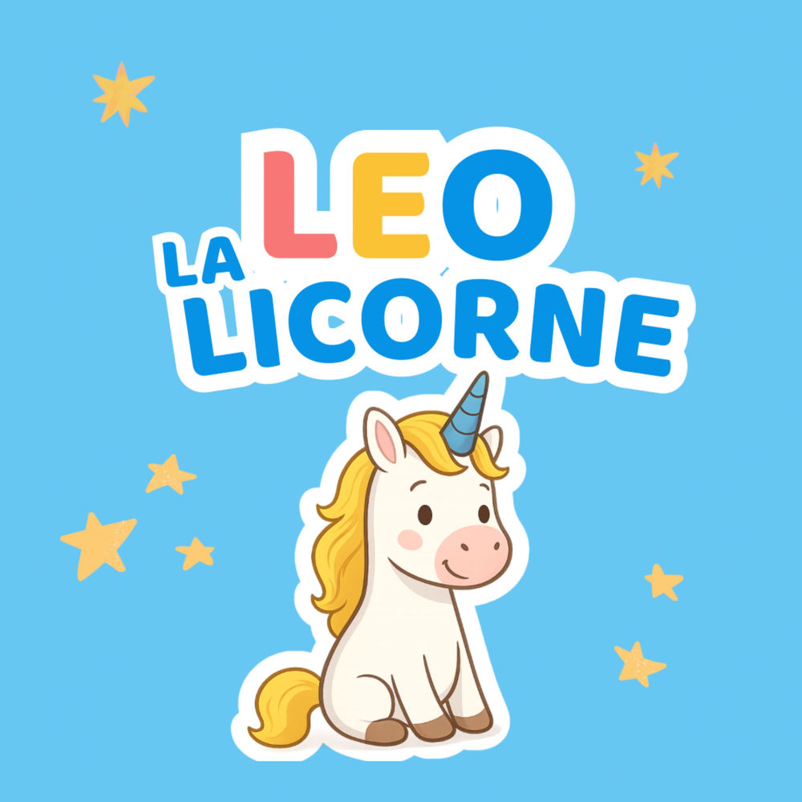</a> 
      <strong>Léo la licorne</strong> 
      <a href="https://drive.proton.me/urls/5ND49D487R#IxRa3Bd0Lm8L">Download from Proton Drive</a>
    </td>
    <td align="center" width="50%">
      <a href="https://drive.proton.me/urls/H7ZTBC8S14#aj2WBn39jDRF">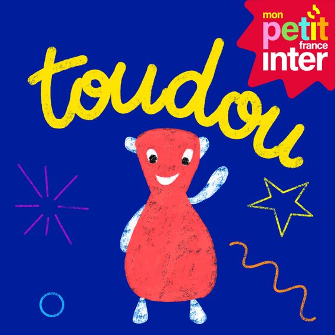</a> 
      <strong>Toudou mon doudou + Cache-Cache — complete collection</strong> 
      <a href="https://drive.proton.me/urls/H7ZTBC8S14#aj2WBn39jDRF">Download from Proton Drive</a>
    </td>
  </tr>
</table>

To explore a pack in Story Studio:

1. Download its ZIP file from Proton Drive.
2. Launch Story Studio and click **Modifier un pack existant** (Modify an existing pack).
3. Select the downloaded `.zip` file.

These packs are distributed separately from the software. Their stories, audio
files and illustrations are not covered by Story Studio's MIT license.

## At a Glance

| | |
|---|---|
| **Status** | Beta |
| **Target platforms** | Windows x64, Linux x86_64 and macOS Apple Silicon |
| **Interface language** | French only for now |
| **Project format** | `.mbah` |
| **Generation format** | Lunii-compatible ZIP packs |
| **Main stack** | React 19, Vite, Tauri 2, Rust |
| **Workflow** | Guided home workflows, Menu Editor, Graph Editor, ZIP pack aggregation, Media Library, Simulator and controlled ZIP generation |
| **Privacy model** | Local app, no hosted backend, no telemetry |

## From first import to finished pack

Story Studio keeps the complete workflow in one local application: start from
your own files or an existing pack, prepare the media, build the navigation,
test the result and generate a pack ready for the story box.

### 1. Start a project or import existing stories

Start however you like, reopen saved work, edit an existing ZIP/7z pack, or
start from a podcast or YouTube source. Dedicated guided flows also let you
aggregate several packs or inspect a community pack.

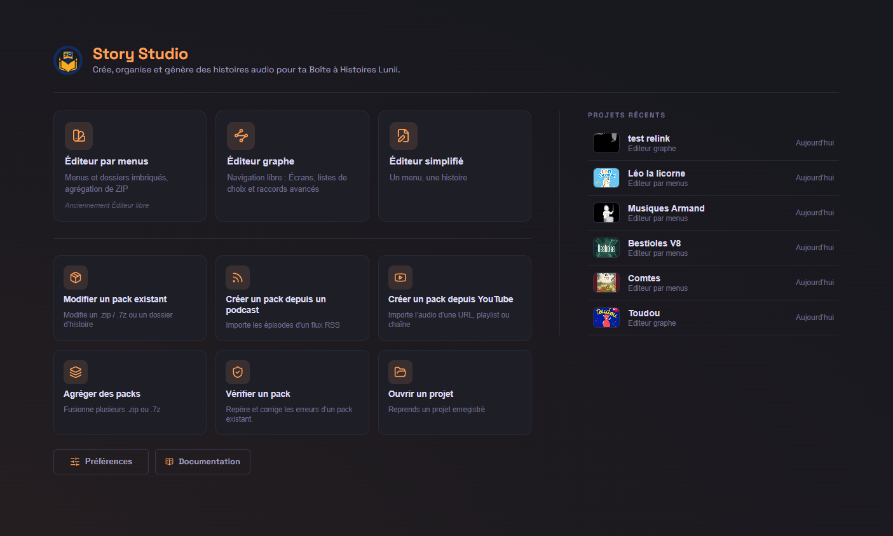

### 2. Prepare the audio

Import or record audio, then adjust it before using it in a story. A long
recording can be split into reusable clips, while several files can be reordered
and assembled into a single track without changing the originals.

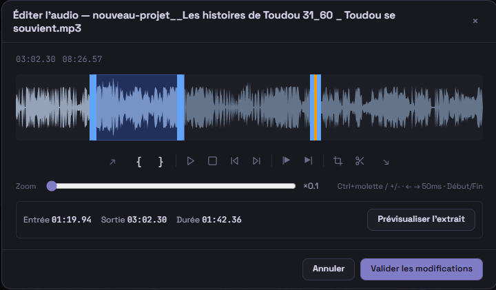

| Split one recording into clips | Assemble several files into one track |
|---|---|
| 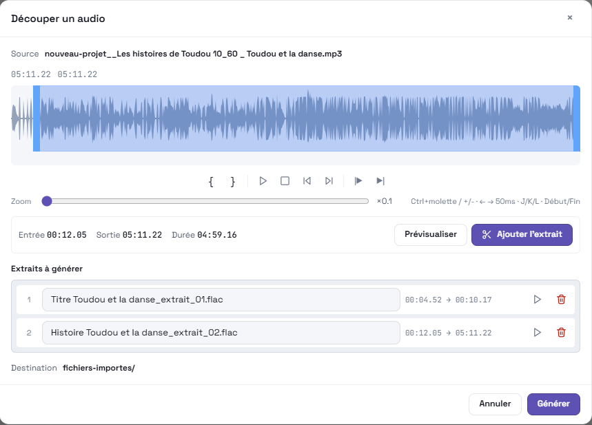 | 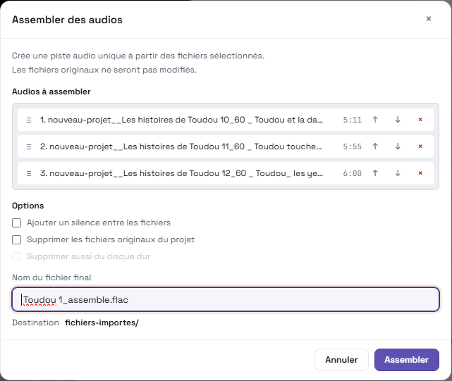 |

### 3. Create voices, generate artwork and adapt images

Generate voices locally with zero-config Piper or use XTTS for advanced voice
cloning. ComfyUI can produce illustrations through a local service, with both
voice and image jobs followed from Story Studio's generation queues.

| Generate a voice locally with Piper or XTTS | Generate an illustration with ComfyUI |
|---|---|
| 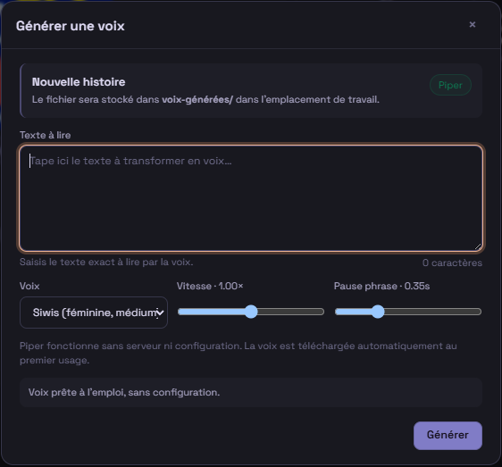 | 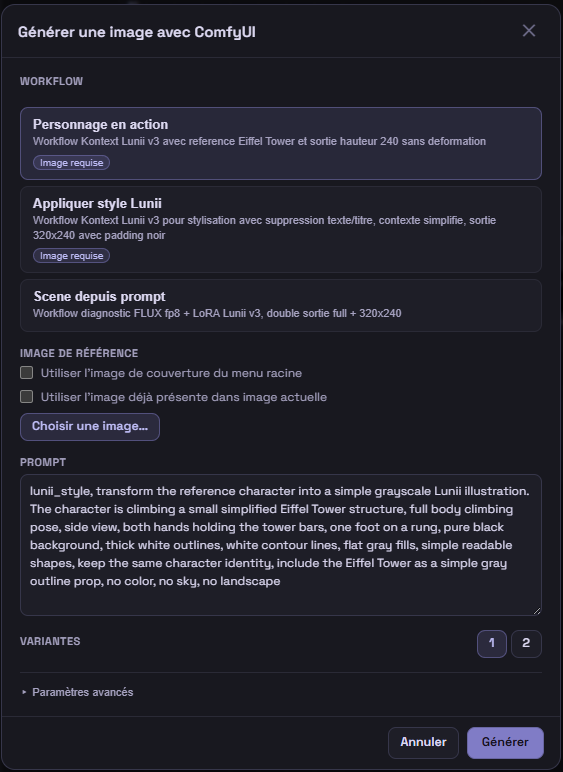 |

Images can then be cropped, resized and adjusted for the 320x240 story-box
format.

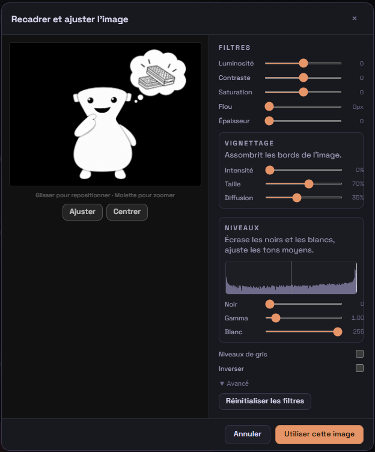

### 4. Build and test the navigation

With the **Menu Editor**, build a tree of Folders and Stories, assign their
images and audio, and define what the buttons do during and after playback.
The Diagram lets you review the resulting path while preserving its
level-by-level organization.

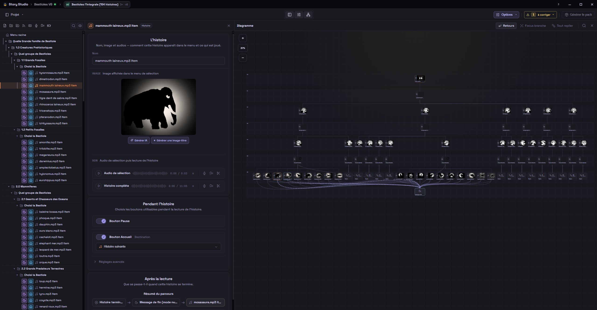

With the **Graph Editor**, work directly with Screens, Choice Lists and their
connections. It supports branching stories, quizzes, random selection and
paths that reuse the same Screens in several places.

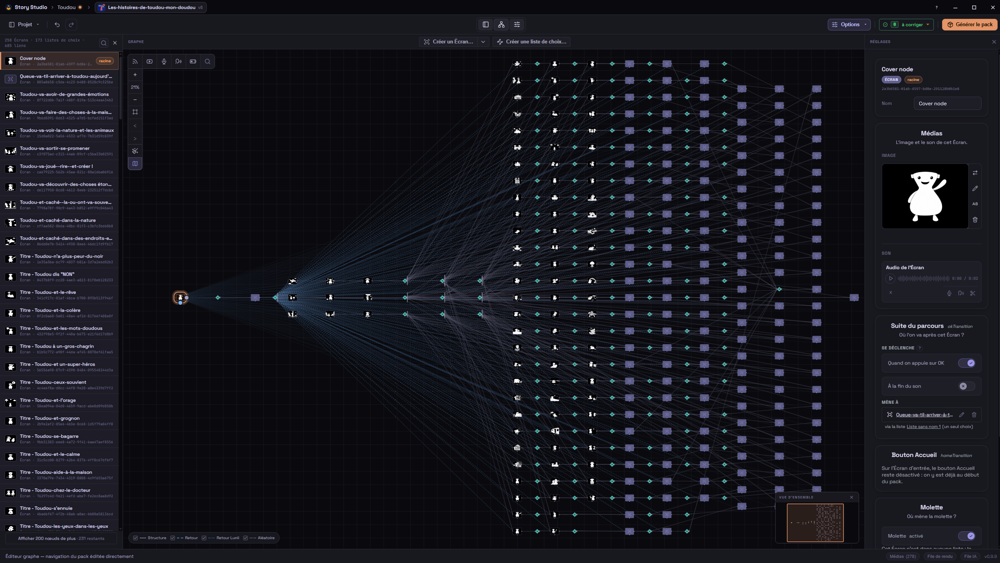

Both editors share the Media Library, audio tools, render queue and the same
floating Simulator. You can play through the navigation before ZIP generation as it
will behave on the story box.

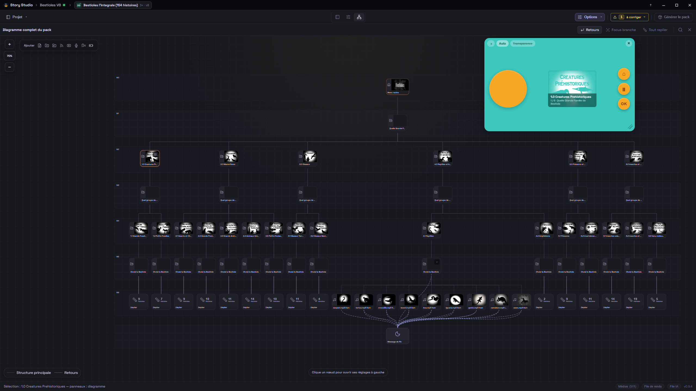

### 5. Review the settings and generate the ZIP

Review the public metadata, catalog thumbnail, output filename, and the pack's
audio or navigation settings. Story Studio checks the structure, identity and
media, then rereads the resulting ZIP before completing ZIP generation.

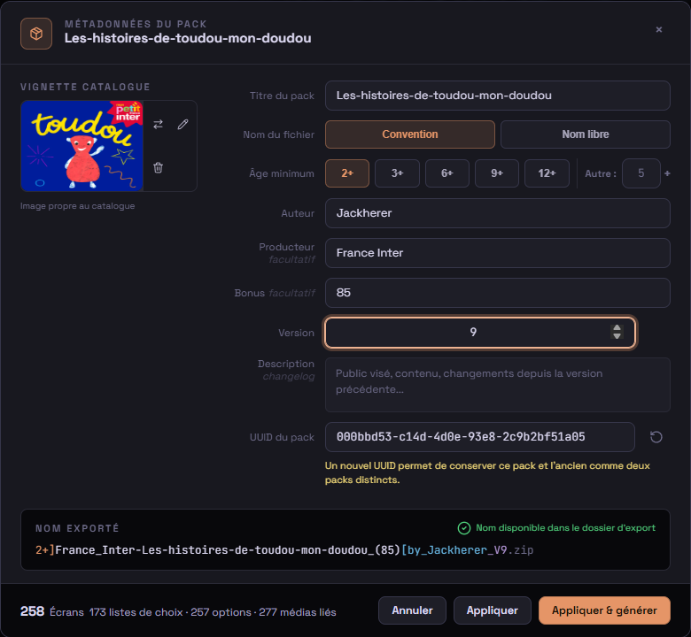

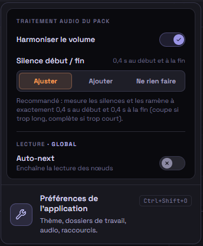

Existing community packs can also be analyzed separately. The checker groups
structural, image and audio findings, proposes safe corrections and can export
a detailed report.

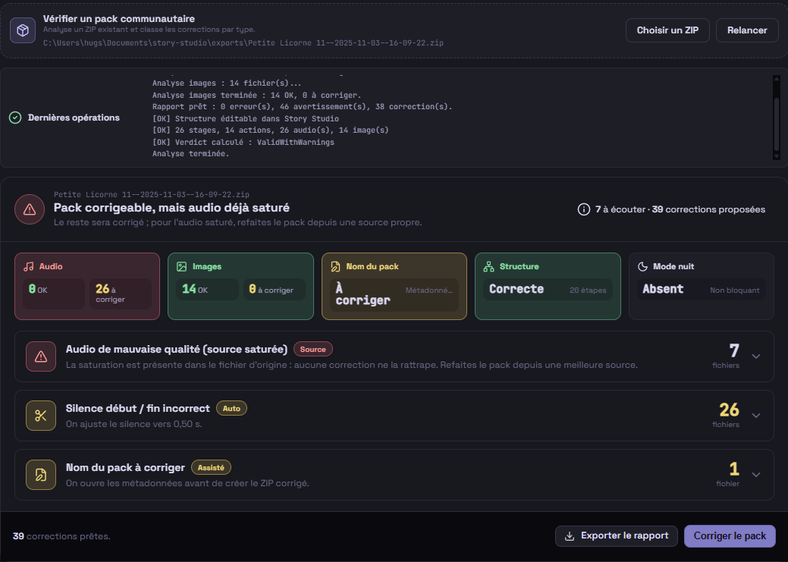

## Features

- **Menu Editor** with Folders, Stories, nested menus, multi-select, drag-and-drop and a Diagram.
- **Graph Editor** with Screens, Choice Lists, connections, multi-selection, clipboard operations and automatic layout.
- **Guided home workflows** to edit an existing pack, create from a podcast or YouTube, aggregate ZIP packs, and check/correct a community pack.
- **Lunii ZIP pack import**: choose between the two editors when possible, open complex structures in the graph, and select a pack from archives containing several packs.
- **Built-in audio workflow**: microphone recording, trimming, cuts, fades, assembly and silence insertion.
- **Built-in image workflow**: automatic 320×240 cropping, text-image generation from node names.
- **Local voice generation** with Piper by default and XTTS as an advanced opt-in backend.
- **Media Library** with tags, filters, usage counters and quick previews.
- **Built-in Simulator** to test navigation and end nodes before ZIP generation.
- **Validation and render queue**: compatibility checks and serial generation with log tracking.
- **Optional local integrations**: YouTube via yt-dlp, XTTS (voice) and ComfyUI (images).
- **Project comfort**: optional-save sessions, autosave, recovery snapshots, safety versions, configurable shortcuts, light/dark themes, full Diagram view.

## Why Story Studio?

I was looking for a simple tool to create audio stories for my child. As a
former video editor, I could never find in existing tools what felt essential
to me: a visual and straightforward interface that makes building a narrative
fluid and frictionless, without relying on command-line tools or dealing with
complex folder structures.

Story Studio was born from that need: bringing import, images, audio,
navigation, simulation and ZIP generation into one clear local workspace.

## Requirements

| Platform | Requirements and limits |
|---|---|
| Windows x64 | Windows 10 or later with WebView2 |
| Linux x86_64 | A glibc-based distribution with WebKitGTK 4.1 and the usual GStreamer codecs; AppImage, DEB and RPM packages are available |
| macOS Apple Silicon | macOS 11 or later on an M1-or-newer Mac; Intel Macs are not supported |

Bundled third-party binaries keep their own licenses and pinned provenance —
see [THIRD_PARTY_NOTICES.md](THIRD_PARTY_NOTICES.md) and the
[corresponding-source offer](THIRD_PARTY_SOURCE_OFFER.md).

## Installation

Download the package for your platform from the
[GitHub Releases page](https://github.com/Hugs11/story-studio/releases/latest):

- **Windows x64:** use the EXE installer, or the MSI package for managed
  deployments.
- **AppImage:** make the file executable with `chmod +x Story-Studio*.AppImage`,
  then run it.
- **Debian/Ubuntu:** install the downloaded DEB with
  `sudo apt install ./Story-Studio*.deb`.
- **Fedora:** install the downloaded RPM with
  `sudo dnf install ./Story-Studio*.rpm`.
- **macOS Apple Silicon:** open the DMG, drag Story Studio into Applications,
  then launch the app.

The macOS build has no Developer ID certificate and is not notarized. Gatekeeper
may therefore block its first launch. In Finder, Control-click the app and
choose **Open**, or use **System Settings → Privacy & Security → Open Anyway**.
Do not disable Gatekeeper globally.

AI integrations are optional. XTTS was tested on Linux in CPU mode; GPU mode
was not validated for 0.9.9. ComfyUI is manually validated on Windows only: manual Linux tests have not been run.

To build from source or contribute, see [CONTRIBUTING.md](CONTRIBUTING.md).

## Project Files and Workspace

Story Studio saves projects as `.mbah` files. Runtime assets are organized in
managed workspace folders:

| Folder | Purpose |
|---|---|
| `fichiers-importes/` | Imported media files when copy-on-import is enabled |
| `enregistrements/` | Microphone recordings |
| `voix-generees/` | XTTS-generated voice clips |
| `images-generees/` | ComfyUI-generated and edited images |
| `zips-extraits/` | Unpacked ZIP collections |
| `sauvegardes/` | Default save folder and safety versions |
| `exports/` | Suggested output folder for generated packs |

Files in managed media folders use a `{project-name}__` prefix so multiple
projects can share the same workspace more safely.

Application data is stored under `%LOCALAPPDATA%\com.hugs11.story-studio` on
Windows, `${XDG_DATA_HOME:-~/.local/share}/com.hugs11.story-studio` on Linux,
and `~/Library/Application Support/com.hugs11.story-studio` on macOS.
User-selected files remain accessible outside these folders, including on
external macOS volumes under `/Volumes`.

When Story Studio offers to delete media from disk, it only deletes files inside
managed workspace media folders. Files stored elsewhere are only removed from the project or the Media Library,
never deleted from disk.

## Documentation

- [Online user documentation](https://hugs11.github.io/story-studio/docs/) — currently available in French
- [Piper and XTTS local voices](https://hugs11.github.io/story-studio/docs/voix-locales-piper-xtts/) — French
- [ComfyUI integration](https://hugs11.github.io/story-studio/docs/comfyui/) — French
- [Security model](SECURITY.md)
- [Third-party notices](THIRD_PARTY_NOTICES.md)
- [Changelog](CHANGELOG.md)

## Roadmap

- Complete and validate the Windows x64, Linux x86_64 and macOS Apple Silicon packages.
- Exit beta with a polished v1.
- Adapt the app to support other story-box devices.

## Contributing

Contributions are welcome, especially:

- Reproducible bug reports.
- Compatibility notes for community packs.
- Documentation improvements.
- Focused pull requests with clear testing notes.

To discuss an idea before opening an issue or quickly share beta-test feedback,
you can also join the
[Story Studio Discord server](https://discord.gg/jztpQz5Ad).

Please read [CONTRIBUTING.md](CONTRIBUTING.md) before opening a pull request.

## Security

Story Studio is a local desktop file editor. Optional XTTS and ComfyUI features
connect to local services configured by the user.

See [SECURITY.md](SECURITY.md) for the permissions model and vulnerability
reporting process.

## License

Story Studio source code is licensed under the [MIT License](LICENSE).

Bundled third-party binaries and copied third-party assets remain under their
respective licenses. See [THIRD_PARTY_NOTICES.md](THIRD_PARTY_NOTICES.md).
